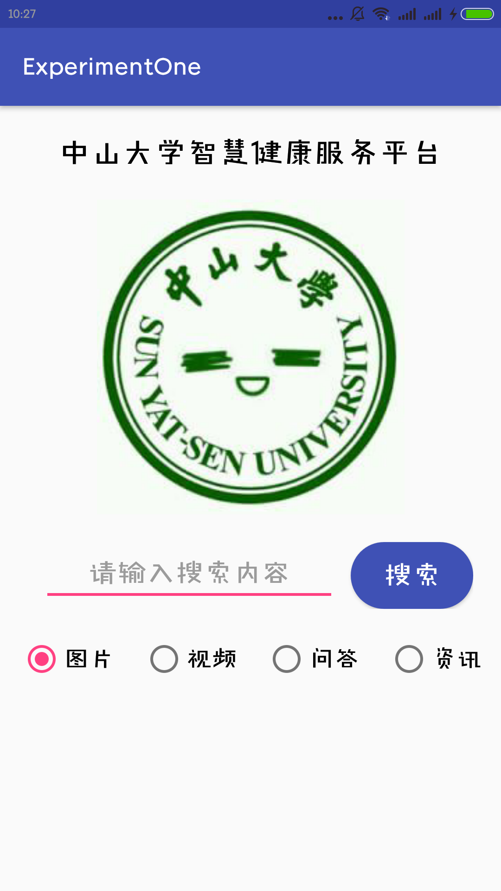
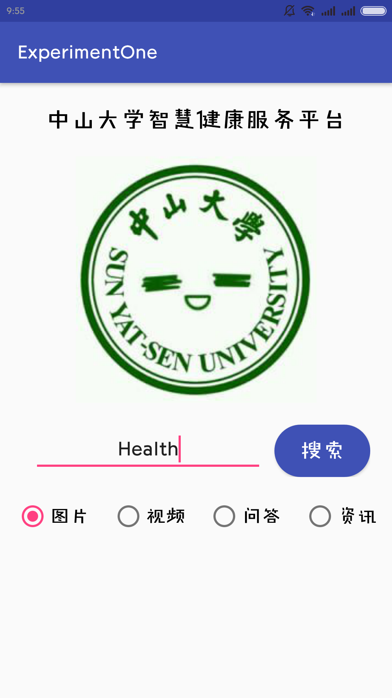
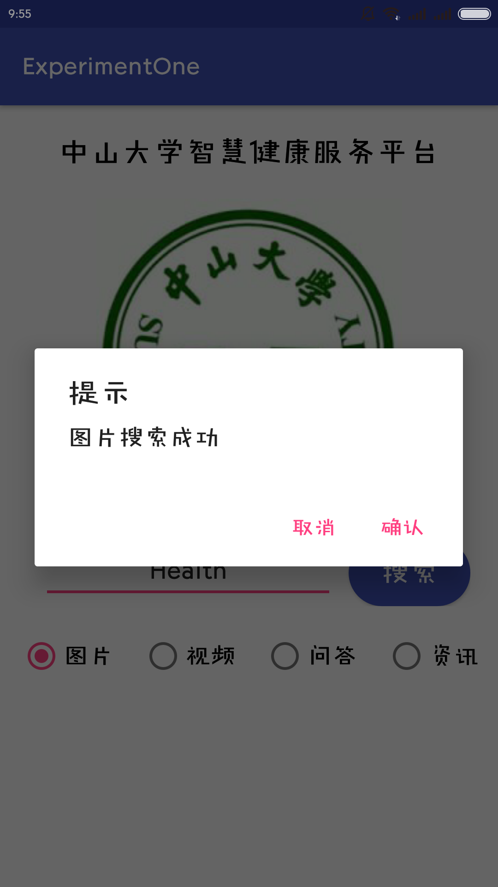
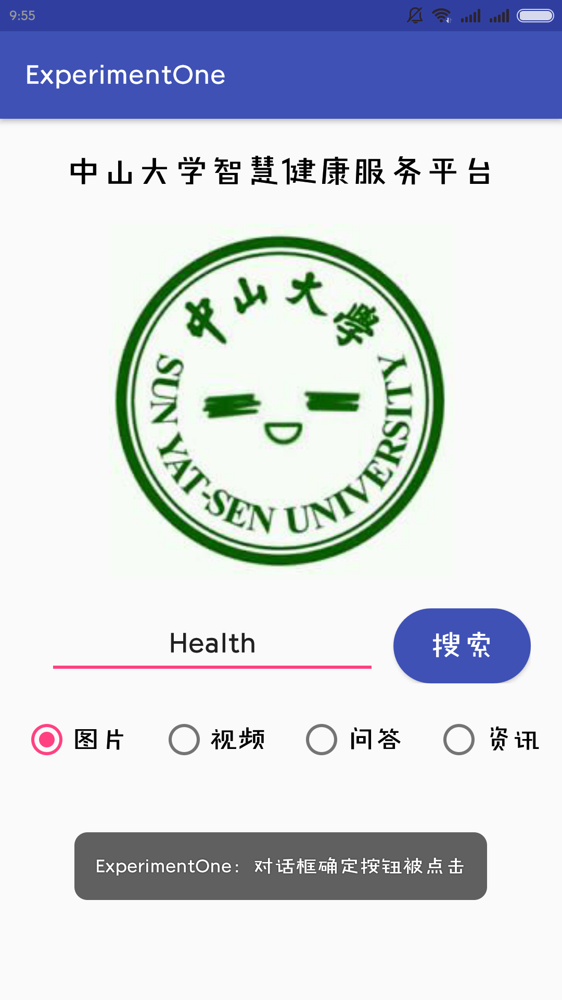
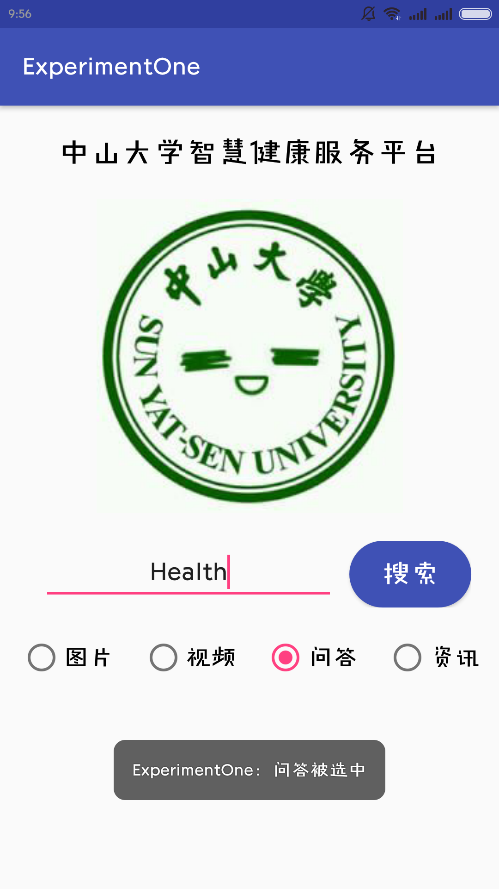
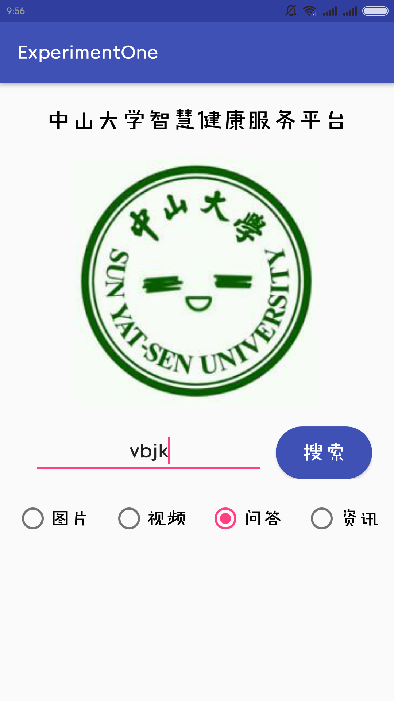
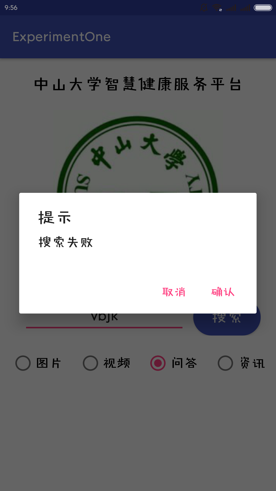

# 中山大学数据科学与计算机学院本科生实验报告
## （2018年秋季学期）
| 课程名称 | 手机平台应用开发 | 任课老师 | 郑贵锋 |
| :------------: | :-------------: | :------------: | :-------------: |
| 年级 | 16级 | 专业（方向） | 电子政务 |
| 学号 | 16340188 | 姓名 | 邵星语 |
| 电话 | 15626237638 | Email | 958465234@qq.com |
| 开始日期 | 9.26 | 完成日期 |10.8|

---

## 一、实验题目

#### 个人项目1-中山大学智慧健康服务平台应用开发

- 基本的UI界面设计
- 基础的事件处理

---

## 二、实现内容

#### 第四周任务：基本的UI界面设计

- 设计一个如要求所示的UI界面
- 各控件的要求
  1. 标题字体大小**20sp**，与顶部距离**20dp**，居中；
  2. 图片与上下控件的间距均为**20dp**，居中；
  3. 输入框整体距左右屏幕各间距**20dp**，内容（包括提示内容）如图所示，内容字体大小**18sp**；
  4. 按钮与输入框间距**10dp**，文字大小**18sp**。按钮背景框左右边框与文字间距**10dp**，上下边框与文字间距**5dp**，圆角半径**180dp**，背景色为**#3F51B5**；
  5. 四个单选按钮整体居中，与输入框间距10dp，字体大小**18sp**，各个单选按钮之间间距**10dp**，默认选中的按钮为第一个。

#### 第五周任务：基础的事件处理

- 在上周完成的基础上进行基础的事件处理
- 各控件处理的要求
  1. 点击搜索按钮：
     - 如果搜索内容为空，弹出Toast信息“**搜索内容不能为空**”。
     - 如果搜索内容为“Health”，根据选中的RadioButton项弹出如下对话框。
     - 点击“确定”，弹出Toast信息——**对话框“确定”按钮被点击**。
       点击“取消”，弹出Toast 信息——**对话框“取消”按钮被点击**。
       否则弹出如下对话框，对话框点击效果同上。
     - RadioButton选择项切换：选择项切换之后，弹出Toast信息“**XX被选中**”，例如从图片切换到视频，弹出Toast信息“**视频被选中**”。

---

## 三、实验结果
### 基本的UI界面设计

#### (1)实验截图

如图所示，UI界面布局如图。



#### (2)实验步骤以及关键代码

按照manual中的指导教程，首先对各个基本部件有了一定的了解。接着就是各个部件的通用属性，在约束布局中如何使用每个属性恰当的安排位置。虽然每个部件并不相同，但基本属性大致相似。

- 例如，约束布局中经常用到的`layout_constraint[组件本身的位置]_to[目标位置]Of="[目标id]"`即是安排部件位置的有效工具。借此我们可以通过依赖父容器、其他组件以及基准线来调整部件的位置。

  水平居中：与父容器左右两边分别对齐；垂直居中同理，上下对齐即可。

  ```xml
  <TextView
      android:id="@+id/Title"
      android:layout_width="wrap_content"
      android:layout_height="wrap_content"
      android:layout_margin="20dp"
      android:text="中山大学智慧健康服务平台"
      android:textSize="20sp"
      android:textColor="#000000"
      app:layout_constraintTop_toTopOf="parent"
      app:layout_constraintLeft_toLeftOf="parent"
      app:layout_constraintRight_toRightOf="parent"/>
  ```

- 部件的长度和宽度。一般来说，长宽可以设置为数值；但由于手机型号不同、难以调节等诸多弊端，一般将其设置为match_parent或wrap_content。从字面上理解，match即是匹配，使部件的长宽匹配父容器（屏幕）的长度或宽度。而wrap_content中的wrap则是“包裹”的意思，可以理解为使部件恰好包裹住部件内的子部件。

- layout_margin和padding是用来指定边距的变量，不同的是前者用于指定外边距，即该部件与其他部件的距离；后者指定内边距，即该部件内部的子部件之间的边距。

- 插入图片时，图片资源一般放在res文件夹里。res文件夹里一般有drawable和mipmap两种文件夹，两种并没有大的差别，官方文档的解释是drawable用来放置图片，而mipmap下放置icon等图标，这也是为什么mipmap文件夹按照不同像素分为不同文件夹的原因。需要使用时，将图片放置在对应像素的文件夹下即可引用。

- 自定义背景边框可以帮助我们将按钮变为圆角矩形。通过修改corner、padding等属性来更改背景及其颜色。

  ```xml
  <corners android:radius="180dp"></corners>
  <solid android:color="#3F51B5"/>
  <padding
      android:bottom="5dp"
      android:top="5dp"
      android:left="10dp"
      android:right="10dp"
      />
  ```

#### (3)实验遇到的困难以及解决思路

1. 关于“输入框整体距左右屏幕各间距**20dp**”，我一开始并不知道怎么使按钮和输入框都与边框隔相同距离，之后将按钮和输入框合成了一个部件，设置部件的外边距为20dp；之后将输入框的左边与父容器的左边对齐，右边与按钮左边对齐，宽度设置为0dp。

   ```xml
   <EditText
       android:id="@+id/Input1"
       android:layout_margin="10dp"
       android:layout_width="0dp"
       android:layout_height="wrap_content"
       android:gravity="center"
       android:hint="请输入搜索内容"
       android:textSize="18sp"
       app:layout_constraintRight_toLeftOf="@id/Button1"
       app:layout_constraintLeft_toLeftOf="parent" />
   ```

2. 插入图片时，res文件夹下有drawable和mipmap两个路径，且mipmap文件夹分了好几种类型；百度发现了两种文件夹的些许区别，最终将图片放在了drawable文件夹下。

### 基础的事件处理

#### （1）实验截图

各个功能的实现如图所示。














#### （2）实验步骤以及关键代码

- 将所有事件整合成两个函数：radioClick()和buttonClick()。

  - radioClick()下实现radioButton不同选项切换时，弹出toast信息；
  - buttonClick()实现点击按钮时进行的查询部分。包括引入输入框和radioButton：
    - 当输入为空时弹出toast信息
    - 当输入不为空，且不为Health时弹出搜索失败
    - 当输入为Health，弹出radioButton的id搜索成功

- 对话框的实现：创建一个AlertDialog.builder对象，设置后用create方法创建dialog对象，使用dialog.show()弹出对话框。以图片搜索成功对话框为例：

  ```java
  final EditText searchContent = (EditText) findViewById(R.id.Input1);
  AlertDialog.Builder AlertPictureSuccess = new AlertDialog.Builder(this);
  AlertPictureSuccess.setTitle("提示");
  AlertPictureSuccess.setMessage("图片搜索成功");
  AlertPictureSuccess.setPositiveButton("确认", new DialogInterface.OnClickListener() {
      @Override
      public void onClick(DialogInterface dialog, int which) {
          Toast.makeText(getApplication(),"对话框确定按钮被点击",Toast.LENGTH_SHORT).show();
          dialog.dismiss();
      }
  });
  AlertPictureSuccess.setNegativeButton("取消", new DialogInterface.OnClickListener() {
      @Override
      public void onClick(DialogInterface dialog, int which) {
          Toast.makeText(getApplication(),"对话框取消按钮被点击",Toast.LENGTH_SHORT).show();
          dialog.dismiss();
      }
  });
  final AlertDialog dialogPicture = AlertPictureSuccess.create();
  ```

- 单击的处理：设置监听，使用onClick方法：

  ```java
  button.setOnClickListener(new View.OnClickListener() {
      public void onClick(View view) {
          if(TextUtils.isEmpty(searchContent.getText().toString())) {
              Toast.makeText(MainActivity.this,"搜索内容不能为空",Toast.LENGTH_SHORT).show();
          }
  ```

#### （3）实验遇到的困难以及解决思路

1.一开始上手遇到的问题是不知道import的包名，使用的很多方法最后还是靠百度找到了导入的包。对于java代码还不够熟悉，可能是由于第一次进行安卓相关的开发，对一些基础的部分掌握的都不是很好，希望有了这次的经验，下次可以逐步熟悉起来。

2.最初引用初始化button等部件、进行单击处理等等直接写在了mainActivity里，导致之后需要使用时setOnclickListner识别不出，button等也识别不出。后来意识到需要将其写进另外一个函数里，再将函数放进onCreate()里运行。

3.实现对话框时不是很理解AlertDialog.builder和dialog对象的关系，对话框的实现部分完成的比较困难。应该是先创建builder，用方法设置好后再用其create()方法创建dialog对象，再用dialog.show()方法显示对话框。

## 五、实验思考及感想

这次实现是手机实验的第一次上手操作，对使用android studio进行手机应用开发有了一定的了解；主要完成了UI的简单布局以及简单的事件处理，使用了几个基本部件，学习了布局时的一些基本属性和技巧，也学会了按钮、单选框等点击事件的监听，熟悉了基本的事件处理。自己对java代码不够熟悉，导致完成作业过程比较生疏，很难得心应手，因此对很多地方还需要慢慢熟悉。

希望有了这次的经验，下次实验能够对代码部分更加熟练，有所进步。功能实现时，要多深入了解相对应的方法及其含义，并动手操作运行，积累基础的实现方法，学会调试、学会看日志的报错解决问题，并在出现问题后寻找应对方案，不断完善代码。

---

#### 作业要求
* 命名要求：学号_姓名_实验编号，例如12345678_张三_lab1.md
* 实验报告提交格式为md
* 实验内容不允许抄袭，我们要进行代码相似度对比。如发现抄袭，按0分处理